# A NNabla Implementation of CapsNet

A NNabla implemntation of the paper [Sara Sabour, Nicholas Frosst, Geoffrey E Hinton. Dynamic Routing Between Capsules. NIPS 2017](https://arxiv.org/abs/1710.09829).

## Notes

There might be some differences between this implemntation and the original paper (since some detailed information are not provided in the paper).

* We use an Adam optimizer with exponential decay with initial alpha `1e-3` and decay rate `0.9` at each epoch.
* Gradient computation of dynamic routing iterations is an option (default: enabled). If you want to disable it, use an option `--disable-grad-dyanmic-routing`.
* The mini-batch size is 100.
* The method of weight initialization is not described in the paper. I chose the initialization method heuristically, and haven't explorered well.

## Usage

To train a CapsNet, run:

```shell
python train.py [-c cudnn] [-d <device_id>] [--disable-grad-dynamic-routing]
```

You can see the list of options by running command with `-h` option.

By default, it runs 50 epochs of training on MNIST dataset. On my GTX 1080, it took about `116s / epoch` and used around 5GB memory.　The implementation is not so efficient. We may need the special layer implementation for the rounting matrix application.

## Results

### Error rate

After 50 epochs of training, I got 0.34% of testing error rate (There is still a gap from the original result (0.25%).

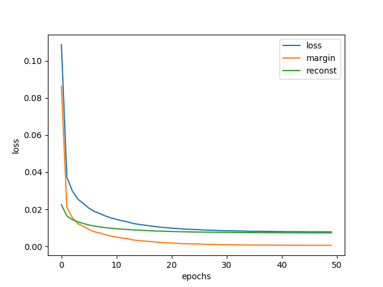

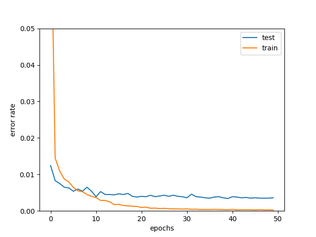

### Visualization of tweaked capsules

The following figures show the reconstruction results from randomly picked test images for 10 digits. The rows correspond to 16 channels in one capsule, and the columns correspond to the noises added to the channel with values from -0.25 to 0.25 with an interval 0.05.

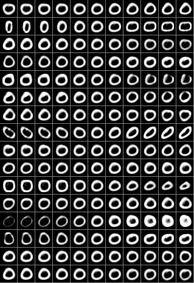

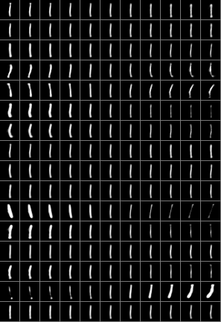

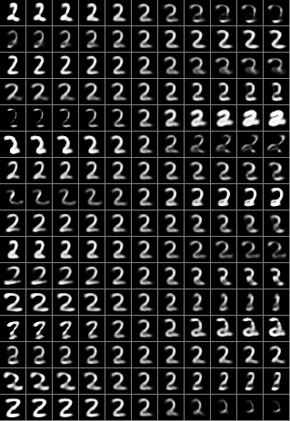

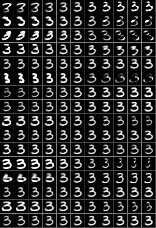

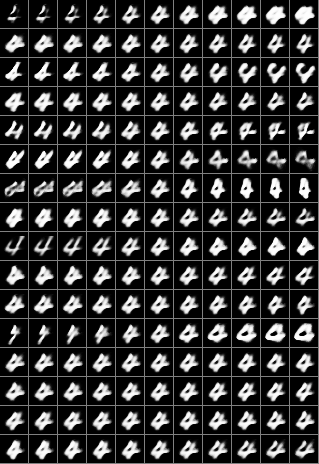

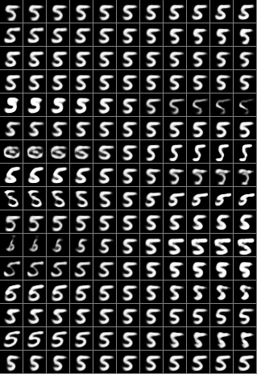

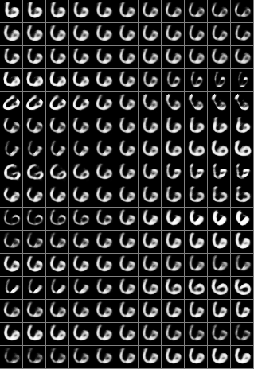

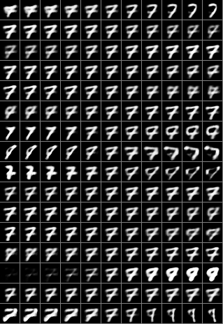

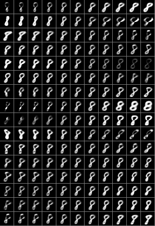

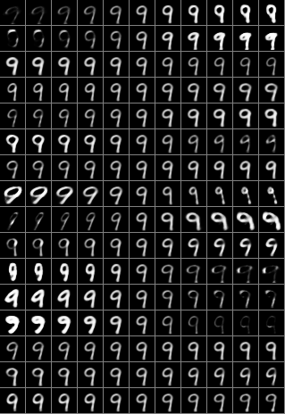
